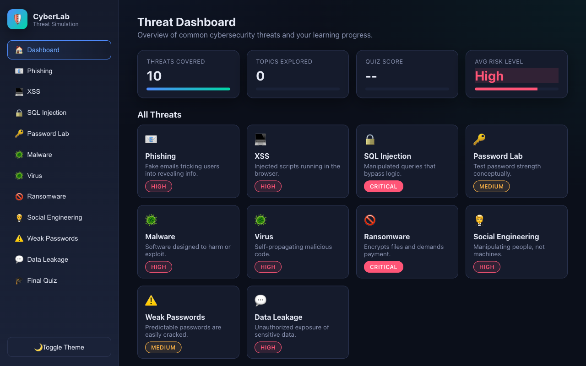
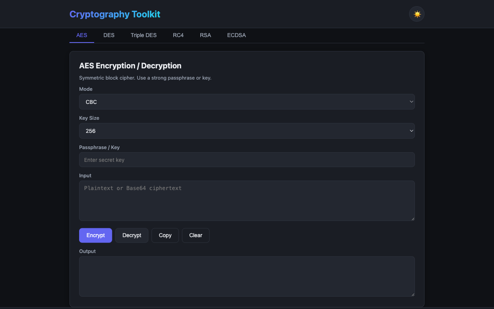
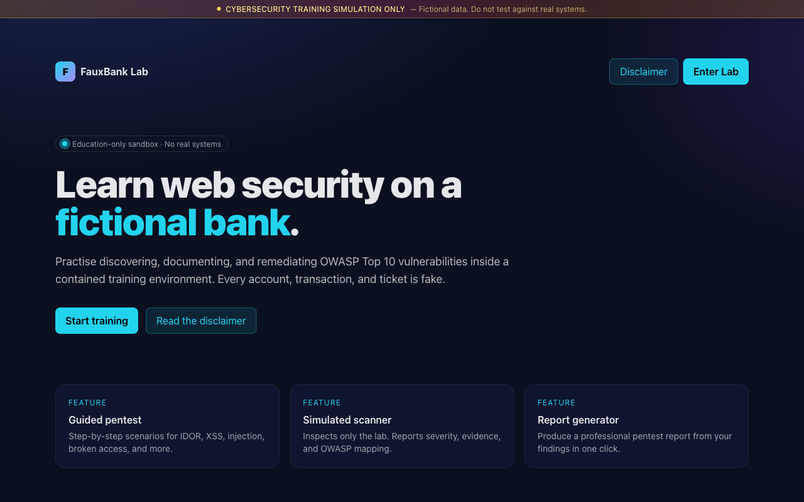
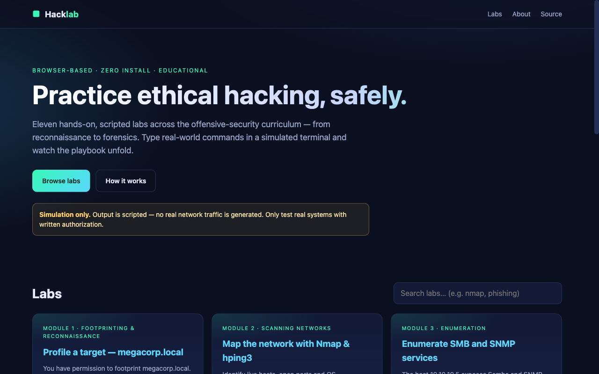

# AI Security Governance for Businesses — Learner Guide

**WSQ Course Code:** TGS-2026061329  |  **Conducted by:** Tertiary Infotech Academy Pte Ltd (UEN 201200696W)  |  **Version v1.0 · 1 September 2026**

## Contents

- [Introduction](#introduction)
- [Course Learning Outcomes](#course-learning-outcomes)
- [Before You Start — Lab Environment](#before-you-start--lab-environment)
- [Topic 01 — AI Security Governance Foundations and Business Risks  (25%)](#topic-01--ai-security-governance-foundations-and-business-risks--25)
  - [Lab 1 — Build the AI System Inventory for NovaBank](#lab-1--build-the-ai-system-inventory-for-novabank)
  - [Lab 2 — Map the AI Threat Landscape with the Threat Simulator](#lab-2--map-the-ai-threat-landscape-with-the-threat-simulator)
  - [Lab 3 — Analyse the Lethal Trifecta in a Live Agent Design](#lab-3--analyse-the-lethal-trifecta-in-a-live-agent-design)
  - [Lab 4 — Build the Business Case for AI Security Governance](#lab-4--build-the-business-case-for-ai-security-governance)
- [Topic 02 — Building an AI Governance Framework: Policies, Roles and Risk Ownership  (25%)](#topic-02--building-an-ai-governance-framework-policies-roles-and-risk-ownership--25)
  - [Lab 5 — Run a NIST AI RMF Gap Assessment](#lab-5--run-a-nist-ai-rmf-gap-assessment)
  - [Lab 6 — Draft the AI Acceptable Use and Governance Policy Set](#lab-6--draft-the-ai-acceptable-use-and-governance-policy-set)
  - [Lab 7 — Design the Governance Operating Model and RACI](#lab-7--design-the-governance-operating-model-and-raci)
  - [Lab 8 — Apply the PDPA and PDPC AI Advisory Guidelines](#lab-8--apply-the-pdpa-and-pdpc-ai-advisory-guidelines)
- [Topic 03 — Governance Controls Across the AI Lifecycle  (25%)](#topic-03--governance-controls-across-the-ai-lifecycle--25)
  - [Lab 9 — Govern the Data: Classification, Minimisation and Protection](#lab-9--govern-the-data-classification-minimisation-and-protection)
  - [Lab 10 — Red-Team an AI System Before Deployment](#lab-10--red-team-an-ai-system-before-deployment)
  - [Lab 11 — Design Deployment Gates and Continuous Monitoring](#lab-11--design-deployment-gates-and-continuous-monitoring)
  - [Lab 12 — Run an AI Incident Response Exercise](#lab-12--run-an-ai-incident-response-exercise)
- [Topic 04 — Security Controls for Agentic AI, Risk Assessment and Implementation Roadmap  (25%)](#topic-04--security-controls-for-agentic-ai-risk-assessment-and-implementation-roadmap--25)
  - [Lab 13 — Design the Agentic Security Control Stack](#lab-13--design-the-agentic-security-control-stack)
  - [Lab 14 — Apply the CSA Agentic Extensions to the NIST AI RMF](#lab-14--apply-the-csa-agentic-extensions-to-the-nist-ai-rmf)
  - [Lab 15 — Conduct a Full AI Security Risk Assessment](#lab-15--conduct-a-full-ai-security-risk-assessment)
  - [Lab 16 — Capstone — Build the AI Security Governance Roadmap](#lab-16--capstone--build-the-ai-security-governance-roadmap)
- [Framework Reference — Ethical Frameworks, Guidelines and Legal Requirements  (K3, A6)](#framework-reference--ethical-frameworks-guidelines-and-legal-requirements--k3-a6)
  - [NIST AI RMF 1.0 — the four functions  (A6)](#nist-ai-rmf-10--the-four-functions--a6)
  - [The seven characteristics of trustworthy AI](#the-seven-characteristics-of-trustworthy-ai)
  - [The 12 NIST generative AI risks (NIST AI 600-1)](#the-12-nist-generative-ai-risks-nist-ai-600-1)
  - [Singapore — the Model AI Governance Framework for Generative AI](#singapore--the-model-ai-governance-framework-for-generative-ai)
  - [Singapore — PDPA and the PDPC AI advisory guidelines  (K3)](#singapore--pdpa-and-the-pdpc-ai-advisory-guidelines--k3)
  - [Agentic AI — OWASP ASI Top 10 and the CSA agentic RMF profile](#agentic-ai--owasp-asi-top-10-and-the-csa-agentic-rmf-profile)
  - [The lethal trifecta](#the-lethal-trifecta)
- [Responsible AI Reference — Ethics, Bias, Privacy and Sustainability](#responsible-ai-reference--ethics-bias-privacy-and-sustainability)
  - [Ethical considerations in AI development (K5)](#ethical-considerations-in-ai-development-k5)
  - [How bias enters an AI system, and what it does (K2, A4, A8)](#how-bias-enters-an-ai-system-and-what-it-does-k2-a4-a8)
  - [The privacy-performance trade-off (A2)](#the-privacy-performance-trade-off-a2)
  - [Environmental impact and the energy footprint (K1, A9)](#environmental-impact-and-the-energy-footprint-k1-a9)
  - [Communicating capabilities and limitations (K4)](#communicating-capabilities-and-limitations-k4)
  - [Championing responsible AI practice (A1, A3, A7)](#championing-responsible-ai-practice-a1-a3-a7)
- [Glossary](#glossary)


## Introduction

This Learner Guide accompanies the WSQ course AI Security Governance for Businesses (TGS-2026061329), conducted by Tertiary Infotech Academy Pte Ltd. It provides the full step-by-step procedure for all 16 hands-on labs, organised by the four course topics, together with the reference material and expert guidance you need to complete each lab and to apply the same method in your own organisation.

Every lab is set in one running case study — NovaBank, a fictional mid-sized Singapore retail bank — so that your outputs compose into a single coherent governance programme rather than sixteen disconnected exercises. What you build in Lab 1 is used in Lab 5; what you assess in Lab 5 drives the policy set in Lab 6, and everything feeds the risk assessment in Lab 15 and the roadmap in Lab 16.

Several labs use browser-based security simulators. These are training environments containing only fictional data and they generate no real network traffic. The techniques they teach must only ever be applied to systems you own or have written authorisation to test — unauthorised access to a computer is a criminal offence under the Singapore Computer Misuse Act and its equivalents elsewhere.


## Course Learning Outcomes

- LO1: Analyse AI security governance foundations and the business risks that AI, generative AI and agentic AI systems introduce across an organisation.
- LO2: Evaluate AI governance frameworks and build an organisational governance structure of policies, roles, risk ownership and accountability.
- LO3: Develop and apply governance controls across the AI lifecycle, from data sourcing and model development through deployment, monitoring and decommissioning.
- LO4: Implement security controls for agentic AI, conduct an AI risk assessment and produce a prioritised AI security governance implementation roadmap.


## Before You Start — Lab Environment

**What you need**

- A laptop with a modern web browser (Chrome, Edge, Firefox or Safari) and internet access. There is nothing to install.
- A spreadsheet application (Excel, Numbers or Google Sheets) for the inventory, RACI, registry and risk-assessment labs.
- A word processor or text editor for the policy, report and board-paper labs.
- The lab pack from the LMS: one folder per lab containing its mock data files and a printable instruction PDF.

**The four browser-based lab tools**

- **Cybersecurity Threat Simulator** — https://alfredang.github.io/cybersecuritysimulator/
- **Hacklab — Ethical Hacking Lab Simulator** — https://alfredang.github.io/ethnicalhacking/
- **FauxBank — Pentest Training Sandbox** — https://pentest-fauxbank.vercel.app/
- **Cryptography Toolkit** — https://alfredang.github.io/cryptography-toolkit/

All four are safe to run on a training network. The Hacklab terminal is scripted and produces no real network traffic; FauxBank is a self-contained sandbox with fictional banking data; the Threat Simulator and Cryptography Toolkit run entirely in your browser.

**The lab pack layout**

```bash
labs/
  lab-01-ai-inventory/
    lab-01-instructions.pdf     <- printable instructions
    data/                       <- the mock data for this lab
      discovery-it-assets.csv
      discovery-procurement.csv
      discovery-staff-survey.csv
  lab-02-threat-landscape/
  ...
  lab-16-capstone-roadmap/
```

**Conventions used in every lab**

- Each lab states an Objective (what it develops), a Goal (the scenario), What you'll build (the artefact you produce) and a Test it (how you know you are done).
- Work the steps in order — later steps assume the outputs of earlier ones.
- Save every artefact you produce. Later labs consume them, and you may use them in the open-book assessment.
- Where a lab asks for a judgement, record the reasoning as well as the conclusion. In governance, the reasoning is the deliverable.

**The running case study — NovaBank**

NovaBank is a fictional mid-sized Singapore retail bank with about 900 staff. It has a mature information-security programme, a Data Protection Officer, and a Model Risk Management function that validates credit and capital models. It has no AI-specific governance at all. It runs a customer-service agent (NovaAssist), a credit decision engine, a fraud triage agent, an IT helpdesk agent, a reconciliation agent in pilot, and an unknown quantity of shadow AI. You are its newly appointed AI Governance Lead.

> **Note:** NovaBank, its staff, customers and data are entirely fictional. Any resemblance to a real organisation or individual is coincidental.


## Topic 01 — AI Security Governance Foundations and Business Risks  (25%)

Why AI changes the risk picture · the AI threat landscape · GenAI and agentic risk · the business case

**Key concepts**

- AI security governance defined — The system of policies, roles, controls and evidence that keeps AI systems secure, lawful and accountable — distinct from, but built on, existing information-security governance.
- Why AI breaks the old model — Traditional controls assume deterministic software with a fixed attack surface. AI systems learn from data, behave probabilistically, and — when agentic — take actions in live systems.
- The expanded attack surface — AI adds five new asset classes to protect: training data, the model itself, prompts and context, the inference endpoint, and the tools an agent can invoke.
- Traditional vs AI-specific threats — SQL injection, XSS and weak credentials still apply. Prompt injection, data poisoning, model inversion, membership inference and model theft are new.
- The NIST GenAI risk set — NIST AI 600-1 names 12 risks unique to or exacerbated by generative AI, including confabulation, data privacy, information security, information integrity and value-chain risk.
- Agentic AI raises the stakes — An agent that can read private data, ingest untrusted content and communicate externally forms the 'lethal trifecta' — the pattern behind most 2025–2026 agent breaches.
- Real incidents, real losses — EchoLeak (CVE-2025-32711, CVSS 9.3) exfiltrated M365 Copilot context with zero user interaction; an over-scoped token let malicious instructions reach a build pipeline.
- Shadow AI is the default state — Staff adopt AI tools faster than governance can approve them; an unowned, uninventoried AI system is the single most common governance failure in businesses.
- Business impact, not technical impact — AI risk translates into regulatory penalties, contractual breach, IP leakage, reputational harm, service failure and unsafe automated decisions about people.
- The Singapore context — Businesses here must satisfy the PDPA, the PDPC AI Advisory Guidelines, IMDA's Model AI Governance Framework for Generative AI and AI Verify testing expectations.
- Governance is a business enabler — Organisations with mature AI governance deploy faster, because approval, evidence and assurance are routine rather than bespoke for every project.
- The AI TRiSM market signal — AI Trust, Risk and Security Management is one of the fastest-growing security segments — evidence that governance spend is now a board-level line item.


### Lab 1 — Build the AI System Inventory for NovaBank

Objective: Analyse an organisation's AI footprint and produce the AI system inventory that every other governance control depends on.

Goal: You are the newly appointed AI Governance Lead at NovaBank, a mid-sized Singapore retail bank. Nobody can tell you how many AI systems the bank runs. You will work from the supplied discovery pack — an IT asset extract, a procurement export and a staff survey — to identify every AI system, classify it, and produce a defensible AI system inventory with named owners and risk tiers.

**What you'll build**

A completed AI System Inventory (ai-inventory.csv) covering 12 AI systems with owner, purpose, data classes, model, autonomy level and risk tier, plus a shadow-AI findings note.

**Tools and data**

Mock data pack (discovery-it-assets.csv, discovery-procurement.csv, discovery-staff-survey.csv), spreadsheet tool   (Lab folder: labs/lab-01-ai-inventory/)

**Step-by-step**

1. Open the three discovery files in labs/lab-01-ai-inventory/data/ and read the column headings before you filter anything. Note that no single file contains the whole picture.
2. Identify AI systems in discovery-it-assets.csv. Flag any row whose vendor, product name or description indicates a model, assistant, copilot, chatbot, scoring engine or agent.
3. Cross-check discovery-procurement.csv for AI services bought outside IT — look for line items charged to a business cost centre rather than to IT.
4. Read discovery-staff-survey.csv for shadow AI: tools staff use that appear in neither of the other two files. These are your highest-priority findings.
5. Merge into one register. For each system record: System ID, Name, Business owner, Purpose, Data classes touched, Model/vendor, Hosting, Autonomy level, Personal data (Y/N).
6. Assign an autonomy level to each system using the four tiers: Tier 1 supervised (suggests only), Tier 2 constrained (acts within a fixed allowlist), Tier 3 broad with monitoring, Tier 4 full autonomy.
7. Assign a risk tier (High / Medium / Low) using two questions: does it make or materially influence a decision about a person, and does it touch personal or confidential data?
8. Name an accountable owner for every system. Any system without a named human owner is itself a finding — record it as such.
9. Write a half-page shadow-AI findings note: how many unapproved tools you found, what data they touch, and the single control you would introduce first.

**Test it**

Your inventory has a row for every AI system in all three files, including at least three shadow-AI tools that appear only in the staff survey. Every row has a named owner, an autonomy tier and a risk tier, and you can justify each High rating in one sentence.

**Guidance and common pitfalls**

- Work the three files in order — IT assets, then procurement, then the staff survey. Each layer finds systems the previous one missed, and that progression is itself the lesson.
- The AI indicator column in the IT extract is an automatic flag and it is not reliable. Read the description column yourself: 'Document OCR Pipeline' is an AI system even where the flag disagrees.
- Expect roughly a dozen AI systems once you merge all three sources, of which at least three appear only in the staff survey. Those three are your shadow-AI findings.
- A system with no named owner is a finding in its own right. Do not quietly assign it to IT to make the register look tidy — record the gap.

> **Note:** The mock data and a printable instruction sheet for this lab are in labs/lab-01-ai-inventory/ (data/ and lab-01-instructions.pdf).

---


### Lab 2 — Map the AI Threat Landscape with the Threat Simulator

Objective: Analyse how traditional security threats and AI-specific threats combine in an AI-enabled business, and explain the business impact of each.

Goal: Governance decisions are only as good as your understanding of the threats. You will use the browser-based Cybersecurity Threat Simulator to experience the classic attack classes hands-on, then extend each one into its AI-era equivalent and record the business impact for NovaBank.

**What you'll build**

A completed Threat-to-Business-Impact map covering 8 threat classes, each with its AI-era variant, the NovaBank asset at risk and a first-line control.

**Tools and data**

Cybersecurity Threat Simulator (https://alfredang.github.io/cybersecuritysimulator/), threat-map worksheet   (Lab folder: labs/lab-02-threat-landscape/)



*The Cybersecurity Threat Simulator dashboard — the ten threat modules you work through in this lab.*

**Step-by-step**

1. Open https://alfredang.github.io/cybersecuritysimulator/ and review the Dashboard. Note the ten threat modules and the risk classification each one carries.
2. Run the Phishing module. Classify at least eight emails as Safe or Phishing, then read the annotated walkthrough and record the red flags you missed.
3. Run the SQL Injection module in vulnerable mode. Enter admin as the username and ' OR '1'='1 as the password, and read the live query display to see exactly why the login succeeds.

   ```bash
   admin  /  ' OR '1'='1
   ```

4. Run the XSS module. Type a script-like string and compare the unsafe rendering against the correctly escaped output. Note that the fix is output encoding, not input blocking alone.
5. Run the Password Lab. Test a weak password and a passphrase, and record the entropy in bits and the estimated crack time for each.
6. Run the Social Engineering trainer. Work through the scenarios and record your score, then note which tactic — pretexting, baiting, vishing, smishing or BEC — you found hardest to spot.
7. Run the Data Leakage risk estimator. Toggle encryption at rest, access controls, private buckets, protected backups, training and DLP, and record how the risk score responds to each control.
8. For each of the eight threat classes above, write the AI-era variant in your worksheet: phishing becomes GenAI-crafted spear-phishing at scale; SQL injection becomes prompt injection into a tool-calling agent; XSS becomes unsafe rendering of model output; weak passwords become over-scoped agent credentials; social engineering becomes model manipulation; data leakage becomes training-data and context-window leakage.
9. Complete the map: for each row add the NovaBank asset at risk, the business impact in one sentence, and the single most effective first-line control.

**Test it**

Your map has all eight threat classes with both the traditional and the AI-era variant filled in. You can state, from the simulator, why parameterised queries stop SQL injection, and explain in one sentence why the same reasoning does not fully stop prompt injection.

**Guidance and common pitfalls**

- Run each simulator module before you fill in its row. The point is to observe the mechanism, not to recall the definition.
- In the SQL injection module, read the live query display carefully. Seeing WHERE user='admin' AND pass='' OR '1'='1' makes clear why the fix is parameterisation — the input became part of the instruction.
- That is exactly the reasoning to carry into prompt injection, with one crucial difference: a prompt has no parameterised form. Data and instructions arrive in the same channel and there is no equivalent of a bound variable. Write that difference in your worksheet.
- The data-leakage estimator is worth pausing on: notice which single control moves the risk score most, and ask whether your organisation actually has it.

> **Note:** The mock data and a printable instruction sheet for this lab are in labs/lab-02-threat-landscape/ (data/ and lab-02-instructions.pdf).

---


### Lab 3 — Analyse the Lethal Trifecta in a Live Agent Design

Objective: Analyse an agentic AI design, identify the lethal-trifecta exposure and the applicable NIST GenAI risks, and propose an architectural break.

Goal: NovaBank's digital team has proposed 'NovaAssist', a customer-service agent that reads the customer's account, searches incoming e-mail and web content for context, and can send e-mails and raise payment instructions. You will analyse the design against the lethal trifecta and the NIST AI 600-1 GenAI risk set, and recommend a redesign.

**What you'll build**

A completed agent risk analysis: the trifecta assessment, five mapped NIST GenAI risks, a documented attack path and a redesign that breaks the trifecta.

**Tools and data**

NovaAssist design brief (novassist-design-brief.md), NIST AI 600-1 risk list, trifecta worksheet   (Lab folder: labs/lab-03-lethal-trifecta/)

**Step-by-step**

1. Read novassist-design-brief.md in labs/lab-03-lethal-trifecta/data/. List every data source the agent reads and every action it can take.
2. Test the design against leg 1 — access to private data. Record exactly which confidential or personal data the agent can reach, and under whose permissions it reads them.
3. Test leg 2 — exposure to untrusted content. Identify every input the agent ingests that an outsider can influence: customer e-mail, web pages, uploaded documents, third-party API responses.
4. Test leg 3 — ability to communicate externally. List every outbound channel: sending e-mail, calling external APIs, writing to shared systems, even rendering links that auto-fetch.
5. Write the attack path in five steps: how an attacker gets untrusted text in front of the agent, how that text redirects the agent's goal, and how data leaves the bank. Base it on the EchoLeak pattern.
6. Map the design against the NIST AI 600-1 GenAI risk set and select the five most relevant: Information Security, Data Privacy, Information Integrity, Human-AI Configuration and Value Chain and Component Integration.
7. For each of the five risks, write one sentence of business impact specific to a Singapore retail bank, including the PDPA exposure where personal data is involved.
8. Propose the architectural break. Choose which leg of the trifecta to remove and justify it — for example, splitting the agent so the tool that reads untrusted content has no outbound channel and no access to account data.
9. Record the residual risk after your redesign, and name the one control you would still add on top of the architecture.

**Test it**

You can state which of the three legs your redesign removes and why removing that leg is more effective than adding an output filter to the original design. Your five NIST risks are each tied to a concrete NovaBank consequence, not a generic description.

**Guidance and common pitfalls**

- Do not skip to the redesign. Complete all three legs of the trifecta first — the redesign is only defensible once you can show the full exposure.
- Leg 2 is the one people under-count. Anything an outsider can influence is untrusted: customer e-mail, uploaded PDFs, web search results, and even a third-party API response.
- For the attack path, follow the EchoLeak shape: attacker plants text where retrieval will find it, the agent reads it as instruction, the agent uses a permitted tool, data leaves. No exploit is required at any step.
- The strongest redesigns split the agent: a retrieval agent that reads untrusted content but holds no account data and no outbound channel, feeding a summary to a second agent that never sees raw external text. Adding an output filter to the original design is the weaker answer, and you should be able to say why.

> **Note:** The mock data and a printable instruction sheet for this lab are in labs/lab-03-lethal-trifecta/ (data/ and lab-03-instructions.pdf).

---


### Lab 4 — Build the Business Case for AI Security Governance

Objective: Analyse the cost of inaction and present a business case that justifies AI security governance investment to a board.

Goal: Governance competes for budget. You will quantify NovaBank's exposure using the incident pack and the cost assumptions provided, then produce a one-page board paper that argues for the governance programme in the language executives use: risk reduction, regulatory exposure and time to deploy.

**What you'll build**

A one-page board paper with a quantified exposure estimate, three prioritised investments and the expected risk reduction for each.

**Tools and data**

Incident cost pack (incident-cost-assumptions.csv, sector-incident-data.csv), board paper template   (Lab folder: labs/lab-04-business-case/)

**Step-by-step**

1. Open incident-cost-assumptions.csv and sector-incident-data.csv in labs/lab-04-business-case/data/ and identify the four cost categories: regulatory, remediation, business interruption and reputational.
2. Use your Lab 1 inventory to count NovaBank's High-risk AI systems and the number that process personal data.
3. Estimate annual expected loss for one realistic scenario — a prompt-injection data leak from a customer-facing agent — using the likelihood and impact figures in the cost pack.
4. Add the regulatory dimension: note the PDPA financial penalty exposure and the reputational consequence of a reported breach for a licensed financial institution.
5. Identify the three highest-value governance investments from your findings so far: the AI inventory and ownership, an acceptable-use policy with mandatory logging, and pre-deployment risk assessment with a human approval gate.
6. For each investment, estimate cost, time to implement and the specific risk it reduces. Express the reduction as a change in likelihood or impact, not as a vague improvement.
7. Add the enabler argument: governed organisations deploy faster because approval and evidence are routine. Quantify it as weeks saved per AI project.
8. Write the one-page board paper: the exposure, the three investments, the expected reduction, and a single clear ask.
9. Present your paper in two minutes to the class and take one challenge question from the trainer acting as CFO.

**Test it**

Your board paper fits on one page, states a number for annual expected loss with its assumptions visible, and each of the three investments names the specific risk it reduces. You can answer the CFO challenge 'why not just buy a tool?' in one sentence.

**Guidance and common pitfalls**

- Use one scenario, costed properly, rather than a list. The prompt-injection leak from a customer-facing agent is the most defensible because you analysed the design in Lab 3.
- Annual expected loss = annual likelihood x total impact. Take likelihood from sector-incident-data.csv and build impact from the four cost categories. Show the arithmetic so a CFO can challenge an assumption rather than the whole number.
- State your assumptions explicitly on the page. A number without visible assumptions gets dismissed; a number with them gets debated, which is what you want.
- Prepare for 'why not just buy a tool?'. The answer: a tool enforces policy — with no inventory, no owner and no policy, there is nothing for it to enforce, and you will have bought a dashboard.

> **Note:** The mock data and a printable instruction sheet for this lab are in labs/lab-04-business-case/ (data/ and lab-04-instructions.pdf).

---


## Topic 02 — Building an AI Governance Framework: Policies, Roles and Risk Ownership  (25%)

NIST AI RMF · MGF for GenAI · PDPA duties · policy architecture · roles, RACI and the AI inventory

**Key concepts**

- NIST AI RMF 1.0 at a glance — A voluntary framework structured as four functions — GOVERN, MAP, MEASURE, MANAGE — that any organisation can adopt without buying a product.
- The seven trustworthiness characteristics — Valid and reliable; safe; secure and resilient; accountable and transparent; explainable and interpretable; privacy-enhanced; and fair with harmful bias managed.
- GOVERN — the cross-cutting function — GOVERN 1 policies and legal duties, GOVERN 2 accountability and training, GOVERN 3 diverse teams, GOVERN 4 risk culture, GOVERN 5 stakeholder engagement, GOVERN 6 third-party risk.
- MAP, MEASURE and MANAGE — MAP frames context and risk; MEASURE selects metrics and tests; MANAGE prioritises, treats, monitors and responds to risks including third-party and residual risk.
- Singapore's MGF for Generative AI — IMDA and AI Verify Foundation set nine dimensions: accountability, data, trusted development and deployment, incident reporting, testing and assurance, security, content provenance, safety R&D and public good.
- AI Verify — testing as evidence — Singapore's AI governance testing framework and toolkit lets an organisation demonstrate, not merely assert, that a system behaves as claimed.
- PDPA duties that bite on AI — Consent and Notification, Accountability, Protection and Retention obligations apply whenever personal data is used to develop or run an AI system.
- Business Improvement and Research exceptions — The PDPC guidelines explain when personal data may be used without fresh consent to develop AI systems — and the conditions and documentation that must accompany that reliance.
- Policy architecture, not a single policy — A workable set is an AI acceptable-use policy, an AI risk-management standard, a data-for-AI standard, a model/agent development standard, and a third-party AI standard.
- Roles and risk ownership — Board and executive accountability, an AI governance committee, business system owners, model owners, the DPO, security, legal, and a named human accountable for each deployment.
- RACI beats goodwill — Every control needs a Responsible doer, an Accountable owner, Consulted specialists and Informed stakeholders — ambiguity is where AI governance quietly fails.
- The AI system inventory — You cannot govern what you cannot see: a register of every AI system with owner, purpose, data classes, model, tools, risk tier and review date is the foundational control.
- Risk tiering drives proportionality — Classify systems by impact on people and business, then scale the control set — light-touch for low-risk internal aids, full assurance for decisions affecting individuals.


### Lab 5 — Run a NIST AI RMF Gap Assessment

Objective: Evaluate an organisation against the NIST AI RMF GOVERN, MAP, MEASURE and MANAGE functions and produce a prioritised gap register.

Goal: NovaBank has an information-security programme but no AI-specific governance. You will assess the bank against the NIST AI RMF using the supplied evidence pack — policy extracts, meeting minutes and interview notes — scoring each subcategory and producing a gap register that drives the rest of the course.

**What you'll build**

A completed NIST AI RMF gap assessment across 16 subcategories, each scored with evidence, plus a top-10 prioritised gap register.

**Tools and data**

Evidence pack (policy-extracts.md, governance-interviews.md, existing-controls.csv), RMF assessment worksheet   (Lab folder: labs/lab-05-nist-rmf-gap/)

**Step-by-step**

1. Open the evidence pack in labs/lab-05-nist-rmf-gap/data/. Read policy-extracts.md and governance-interviews.md fully before scoring anything — score on evidence, not impression.
2. Score the GOVERN function. Assess GOVERN 1.1 legal and regulatory requirements, 1.2 trustworthiness in policy, 1.6 AI system inventory, 1.7 decommissioning, 2.1 roles and responsibilities, 2.3 executive accountability and 6.1 third-party AI risk.
3. Use a four-point scale for every subcategory: 0 Not in place, 1 Ad hoc, 2 Defined but not consistently applied, 3 Managed with evidence. Record the specific evidence line that justifies each score.
4. Score the MAP function: MAP 1.1 intended purpose and context, 1.5 risk tolerances, 2.3 TEVV considerations, and whether risk is framed per system or only at portfolio level.
5. Score the MEASURE function: MEASURE 1.1 metrics selected, 1.3 independent internal review, and whether any AI system is currently tested for bias, robustness or jailbreak resistance.
6. Score the MANAGE function: MANAGE 1.2 risk prioritisation, 1.4 residual risk documented and accepted by a named owner, and 4.1 post-deployment monitoring.
7. Calculate the average score per function and identify which function is weakest. In most organisations with mature InfoSec, MEASURE scores lowest — check whether that holds here.
8. Build the gap register: for each gap record the subcategory, current score, target score, business risk if unaddressed, remediation action, owner and effort (S/M/L).
9. Prioritise the top ten gaps by risk reduction per unit of effort, not by score alone. A cheap fix closing a High risk outranks an expensive fix closing a Medium one.

**Test it**

Every subcategory score cites a specific line of evidence from the pack. Your gap register's top three items are all High-risk, and you can defend why a lower-scoring subcategory did not make the top ten.

**Guidance and common pitfalls**

- Score only on the evidence in the pack. If the interview does not support a 2, it is a 1, however capable the organisation feels.
- GOVERN 1.6 (AI inventory) is a 0 here — the CMDB excludes SaaS AI features and the CRO guesses at 'three or four' systems. That single gap invalidates most downstream controls, which is why it belongs near the top of your register.
- Note the trap in Extract D: model retraining and prompt changes are treated as 'configuration' and bypass CAB entirely. That is a change-control gap that no amount of infrastructure review will catch.
- MEASURE will score lowest. No AI system is tested for bias, robustness or jailbreak resistance — the Head of Digital Channels confirms 200 accuracy questions and nothing else.
- Prioritise by risk reduction per unit of effort. Turning on logging is a small effort closing a High risk, and it should outrank a large effort closing a Medium one.

> **Note:** The mock data and a printable instruction sheet for this lab are in labs/lab-05-nist-rmf-gap/ (data/ and lab-05-instructions.pdf).

---


### Lab 6 — Draft the AI Acceptable Use and Governance Policy Set

Objective: Evaluate policy requirements and develop an enforceable AI policy set aligned to the NIST AI RMF and Singapore's MGF for Generative AI.

Goal: Policy is where governance becomes enforceable. You will draft NovaBank's AI Acceptable Use Policy and the supporting standard, working from the gap register you produced in Lab 5 and the nine dimensions of Singapore's Model AI Governance Framework for Generative AI.

**What you'll build**

A complete AI Acceptable Use Policy (2 pages) plus a one-page AI Risk Management Standard, both mapped to MGF dimensions and RMF subcategories.

**Tools and data**

Policy templates (aup-template.md, standard-template.md), MGF nine dimensions reference, Lab 5 gap register   (Lab folder: labs/lab-06-policy-set/)

**Step-by-step**

1. Open aup-template.md in labs/lab-06-policy-set/data/ and review the required sections: purpose, scope, definitions, permitted use, prohibited use, approval, roles, monitoring, breach and review.
2. Define scope precisely. State whether the policy covers public GenAI tools, embedded AI features in existing SaaS, internally built models and third-party agents — vague scope is the most common policy defect.
3. Write the permitted-use section. Specify what staff may do with approved AI tools, with which data classifications, and under what logging.
4. Write the prohibited-use section with concrete rules: no confidential or personal customer data into unapproved tools; no AI-generated code merged without human review; no automated decision about a customer without a documented human check.
5. Write the approval pathway. State who approves a new AI system, what evidence they need, and the maximum turnaround — a pathway with no service level is a pathway staff will bypass.
6. Map every clause to the MGF dimension it serves — accountability, data, trusted development and deployment, incident reporting, testing and assurance, security, content provenance — and record the mapping in a table.
7. Draft the one-page AI Risk Management Standard: risk tiering criteria, the assessment required at each tier, who signs off, and the review frequency.
8. Add the enforcement and consequence section, and the review cycle with a named owner and a date. A policy with no owner and no review date is already obsolete.
9. Peer-review another group's policy against one test: could a member of staff read this and know exactly what they may and may not do on Monday morning? Record two specific improvements.

**Test it**

Your AUP states at least six concrete prohibited actions, names the approver and the turnaround time, and every clause maps to at least one MGF dimension. A peer confirms they could apply your policy without asking you a question.

**Guidance and common pitfalls**

- Write for the person who must follow it, not for the auditor who will file it. The test at the end of the lab is the real quality bar: could a colleague read it and know what to do on Monday?
- Be explicit about scope. The most common failure is a policy that never says whether it covers M365 Copilot, a personal ChatGPT account, or an AI feature switched on inside a SaaS tool you already own.
- Prohibited-use rules must be concrete enough to detect. 'Use AI responsibly' is unenforceable; 'do not enter customer personal data into any tool not on the approved list' can be evidenced and trained.
- Commit to an approval turnaround in days. Without a service level, staff route around the process, and your policy has quietly created more shadow AI than it prevented.
- The MGF mapping is not decoration — it is how you show a Singapore regulator or a client that your policy set aligns with the national framework.

> **Note:** The mock data and a printable instruction sheet for this lab are in labs/lab-06-policy-set/ (data/ and lab-06-instructions.pdf).

---


### Lab 7 — Design the Governance Operating Model and RACI

Objective: Evaluate accountability requirements and develop a governance operating model with committee structure, roles and a control-level RACI.

Goal: Policies fail without owners. You will design NovaBank's AI governance operating model: the committee that decides, the roles that execute, and a RACI matrix that removes ambiguity from the twelve controls you have identified so far.

**What you'll build**

A governance operating model diagram, committee terms of reference, six role descriptions and a RACI matrix covering twelve AI governance controls.

**Tools and data**

Org chart (novabank-org-chart.md), role catalogue, RACI template   (Lab folder: labs/lab-07-operating-model/)

**Step-by-step**

1. Open novabank-org-chart.md in labs/lab-07-operating-model/data/ and identify which existing forums and roles you can reuse. Building a parallel governance structure is a known failure mode — reuse first.
2. Define the AI Governance Committee: purpose, membership, chair, quorum, meeting frequency and — critically — its decision rights. A committee that can only advise cannot govern.
3. Write the escalation path: which decisions the committee takes, which go to the executive risk committee, and which reach the board. Name the trigger for each escalation.
4. Define six roles with one paragraph each: Executive Accountable Owner, AI Governance Lead, AI System Owner, Data Protection Officer, Security Lead and Model/Agent Developer.
5. For each role state the one decision that role owns outright. If two roles claim the same decision, resolve it now — that conflict will otherwise surface during an incident.
6. Build the RACI across twelve controls: inventory maintenance, risk assessment, data approval, model approval, pre-deployment testing, deployment sign-off, human-oversight design, monitoring, logging, incident response, third-party AI review and decommissioning.
7. Apply the single-A rule: exactly one Accountable per control. Multiple A's mean nobody is accountable — fix every row that breaks this rule.
8. Cross-check the RACI against NIST GOVERN 2.1 roles and responsibilities and GOVERN 2.3 executive accountability, and record how your model satisfies each.
9. Stress-test the model: walk through the Lab 3 NovaAssist prompt-injection incident and confirm your model shows who detects it, who decides to disable the agent, and who notifies the PDPC if personal data was exposed.

**Test it**

Every one of the twelve controls has exactly one Accountable role. Walking the NovaAssist incident through your model produces a named person at every step, with no gaps and no two people claiming the same decision.

**Guidance and common pitfalls**

- Reuse before you create. The CRO has explicitly refused a new committee unless you show existing forums cannot absorb the remit, and that constraint reflects real organisational life.
- Decision rights are the section that matters. Write which decisions this committee takes, which escalate to the ERC and which reach the board — a committee that can only advise cannot govern.
- Apply the single-A rule strictly. If two roles are Accountable for one control, each will assume the other has it, and you will discover the gap during an incident.
- The stress test is the real assessment: walk the NovaAssist incident through your model. Detection, the decision to disable, and the PDPA notification must each land on a named role with no gaps and no overlaps.

> **Note:** The mock data and a printable instruction sheet for this lab are in labs/lab-07-operating-model/ (data/ and lab-07-instructions.pdf).

---


### Lab 8 — Apply the PDPA and PDPC AI Advisory Guidelines

Objective: Evaluate the lawful basis for using personal data in AI systems under Singapore's PDPA and apply the PDPC AI advisory guidelines to four scenarios.

Goal: Singapore-specific compliance is where many AI projects stall. You will assess four NovaBank AI use cases against the PDPA obligations and the PDPC Advisory Guidelines on the Use of Personal Data in AI Recommendation and Decision Systems, and determine the lawful basis and the required notifications.

**What you'll build**

A PDPA compliance determination for four AI use cases, each with lawful basis, required notification, accountability measures and documentation.

**Tools and data**

PDPA scenario pack (pdpa-scenarios.md), PDPC guidelines summary, determination worksheet   (Lab folder: labs/lab-08-pdpa-application/)

**Step-by-step**

1. Open pdpa-scenarios.md in labs/lab-08-pdpa-application/data/. The four scenarios are: a product recommendation model, a credit-decision support model, a staff-facing GenAI assistant, and a third-party developed fraud model.
2. For scenario 1, the recommendation model, assess whether the Business Improvement Exception applies. Check the purpose against the exception's conditions and record whether fresh consent is needed.
3. For scenario 2, the credit decision support model, note that it materially affects an individual. Determine the notification required and the human-oversight measure that must accompany the decision.
4. For scenario 3, the staff GenAI assistant, identify the risk that customer personal data is pasted into prompts. Determine the controls: data classification rules, input filtering, logging and retention limits.
5. For scenario 4, the third-party fraud model, identify the developer's status as a data intermediary and the Protection and Retention Obligations that follow, plus the contractual terms you require.
6. For every scenario record the Consent and Notification position: whether consent is relied on, whether an exception applies, and exactly what must be told to the individual.
7. Apply the Accountability Obligation to all four: what policies, records and internal processes must NovaBank be able to produce if the PDPC asks.
8. Record the data-protection measures the PDPC guidelines expect when personal data is used in AI development: minimisation, anonymisation or pseudonymisation where feasible, access control and retention limits.
9. Write the one-paragraph determination for each scenario: lawful basis, notification, controls, documentation and the residual legal risk you would escalate to the DPO.

**Test it**

Each of the four scenarios has a stated lawful basis with a reason. You can explain the difference between the Business Improvement Exception and the Research Exception in one sentence, and say which scenario needs the strongest human-oversight measure and why.

**Guidance and common pitfalls**

- Read the scenario for what the system does to a person, not for what technology it uses. That is what drives the PDPA analysis.
- Scenario 1 is the clearest Business Improvement Exception case — improving an existing product with an existing customer's data. Record the basis in writing; the exception does not remove the Accountability Obligation.
- Scenario 2 materially affects an individual, so the notification and human-oversight requirements are strongest here. Note the postal-code feature: it can act as a proxy for ethnicity or income and create discrimination risk even where the field is lawful to use.
- Scenario 3 is a controls question rather than a lawful-basis question. The risk is staff pasting customer data into prompts, so the answer is classification rules, input filtering, logging and retention limits.
- Scenario 4: the vendor is a data intermediary carrying the Protection and Retention Obligations. On 'anonymised learnings', ask what exactly is anonymised — a model trained on your customers' data is not obviously anonymous, and this belongs in the contract, not in an e-mail.

> **Note:** The mock data and a printable instruction sheet for this lab are in labs/lab-08-pdpa-application/ (data/ and lab-08-instructions.pdf).

---


## Topic 03 — Governance Controls Across the AI Lifecycle  (25%)

Data governance · secure development · testing and red-teaming · deployment · monitoring · incident response · decommissioning

**Key concepts**

- The AI lifecycle as a control surface — Plan, source data, develop, test, deploy, operate and monitor, then decommission — each stage has its own failure modes and its own controls.
- Data governance for AI — Provenance, lawful basis, quality, classification, minimisation, de-identification, retention and deletion — decided before a model is trained, not after.
- Personal data in AI systems — Under the PDPC guidelines, organisations should apply data-protection measures such as minimisation, anonymisation and access control when using personal data in AI development.
- Data poisoning and supply chain — Training and fine-tuning data, embeddings, third-party models and packages are all supply-chain entry points; pin versions and validate sources.
- Secure AI development — Threat-model the system, protect prompts and secrets, isolate environments, review AI-generated code, and control who can change a model or instruction.
- Testing, evaluation and assurance — Functional accuracy is not enough: test robustness, bias, privacy leakage, jailbreak resistance and grounding before release, and record the evidence.
- Red-teaming AI systems — Adversarial testing against prompt injection, jailbreaks, data leakage and unsafe tool use — run before production and after every significant change.
- Deployment gates — A go/no-go decision with named approvers, documented residual risk, rollback plan, and a transparency notice where individuals are affected.
- Human oversight by design — Define where a human reviews, approves or can override, and make the escalation path fast enough to actually be used.
- Continuous monitoring — Watch drift, output quality, refusal and jailbreak rates, cost, latency and anomalous access — AI risk changes after deployment, not just before.
- Logging and auditability — Retain prompts, outputs, tool calls, approvals and model versions to the extent lawful, so an incident can be reconstructed and a decision explained.
- AI incident response — Extend the existing IR plan: how to disable an AI system fast, preserve evidence, assess personal-data impact, and notify under the PDPA where required.
- Decommissioning safely — Retire models and agents deliberately — revoke credentials, dispose of memory and embeddings, preserve audit logs and update dependent systems.


### Lab 9 — Govern the Data: Classification, Minimisation and Protection

Objective: Develop and apply data governance controls for an AI training set, including classification, minimisation, de-identification and retention.

Goal: NovaBank wants to train a churn-prediction model on customer data. You will govern the dataset before a single model is trained: classify every field, strip what is not needed, de-identify what remains, and prove the protection using the Cryptography Toolkit for hashing and encryption.

**What you'll build**

A governed training dataset specification: a field-by-field classification and minimisation decision, a de-identification method per field, and a tested hashing approach with retention rules.

**Tools and data**

Customer dataset (customer-training-data.csv, data-dictionary.md), Cryptography Toolkit (https://alfredang.github.io/cryptography-toolkit/)   (Lab folder: labs/lab-09-data-governance/)



*The Cryptography Toolkit — AES, RSA and ECDSA, used to test protection of the training data.*

**Step-by-step**

1. Open customer-training-data.csv and data-dictionary.md in labs/lab-09-data-governance/data/. The set has 24 fields and 200 rows of fictional customer records.
2. Classify every field into one of four classes: Direct identifier (NRIC, name, phone, email), Quasi-identifier (postal code, date of birth, gender), Sensitive attribute (income, health flag, religion) or Non-personal (product code, tenure months).
3. Apply minimisation. For each field ask one question: does the churn model actually need this to predict churn? Mark every field Keep, Drop or Transform, and write the reason. Expect to drop at least eight fields.
4. Decide the de-identification method per retained field: remove, hash, generalise (age band instead of date of birth), or keep as is. Record why each method suits that field.
5. Open https://alfredang.github.io/cryptography-toolkit/ and use the AES section to encrypt a sample customer record. Use AES-256 in CBC mode with a passphrase, and note that the same input with the same key produces recoverable ciphertext.

   ```bash
   AES-256 · CBC · passphrase
   ```

6. Now test the difference between encryption and hashing for identifiers. Encrypt an NRIC-style string, then decrypt it back. Record that encryption is reversible and therefore still personal data in the hands of the key holder.
7. Use the RSA section to generate a 2048-bit key pair, and note where asymmetric encryption fits in an AI pipeline: protecting keys and data in transit between the data platform and the training environment, not bulk field-level protection.

   ```bash
   RSA 2048 · generate key pair
   ```

8. Use the ECDSA section to sign a short message and verify the signature. Record how signing gives you dataset integrity — proof that the training set was not altered between approval and training.

   ```bash
   ECDSA P-256 · sign then verify
   ```

9. Write the retention and deletion rule for the governed dataset: how long the training set is kept, what happens to the model when a customer exercises deletion, and where the audit record of this decision lives.
10. Complete the dataset specification and record the lawful basis you determined for this use in Lab 8, so the data decision and the legal decision live in one document.

**Test it**

You dropped at least eight fields with a stated reason, every retained personal field has a de-identification method, and you can explain to a business stakeholder why hashing an identifier is not the same as anonymising the record.

**Guidance and common pitfalls**

- Classify before you minimise, and minimise before you de-identify. Doing it in that order removes most of the work, because a dropped field needs no protection at all.
- Ask the minimisation question honestly for each field: does churn prediction need it? Name, NRIC, e-mail, mobile and address plainly do not. Religion and ethnicity not only fail the test but create discrimination risk if the model learns from them.
- Postal code is the interesting case. It has predictive value and it is a strong quasi-identifier and a proxy for income. Generalising to a district is usually the right call — record your reasoning either way.
- In the Cryptography Toolkit, encrypt an identifier with AES and then decrypt it back. That round trip is the point: encryption is reversible, so an encrypted NRIC remains personal data to whoever holds the key.
- Use ECDSA signing for dataset integrity — sign the approved training set so you can later prove it was not altered between approval and training. This is the control auditors ask for and few organisations have.
- Never describe the result as 'anonymised' if you hashed identifiers. It is pseudonymised, and PDPA obligations continue to apply.

> **Note:** The mock data and a printable instruction sheet for this lab are in labs/lab-09-data-governance/ (data/ and lab-09-instructions.pdf).

---


### Lab 10 — Red-Team an AI System Before Deployment

Objective: Develop pre-deployment assurance by red-teaming an AI application for injection, access-control and data-leakage weaknesses, and record the evidence.

Goal: Testing that a model is accurate is not assurance. You will run an adversarial pre-deployment test against the FauxBank training sandbox, find the vulnerability classes that matter for an AI-enabled banking application, and produce the test evidence a deployment gate requires.

**What you'll build**

A pre-deployment red-team report: findings with severity, evidence and OWASP mapping, extended with the AI-specific test cases and a go/no-go recommendation.

**Tools and data**

FauxBank pentest sandbox (https://pentest-fauxbank.vercel.app/), Hacklab (https://alfredang.github.io/ethnicalhacking/), red-team report template   (Lab folder: labs/lab-10-red-team/)



*FauxBank — the pentest training sandbox used for the guided scenarios and the simulated scanner.*



*Hacklab — the simulated terminal used for the reconnaissance and enumeration stages.*

**Step-by-step**

1. Open https://pentest-fauxbank.vercel.app/ and read the disclaimer: this is a training sandbox with fictional data. Never run these techniques against a real system without written authorisation.
2. Work through the Guided Pentest scenarios. Record each finding as you go — what you did, what happened, and what it proves about the control that failed.
3. Test for IDOR (Insecure Direct Object Reference). Change an identifier in a request and observe whether you reach another user's record. Note why this matters doubly for an AI agent, which iterates far faster than a human.
4. Test for broken access control and injection using the guided scenarios, and record the evidence for each: the input, the response, and the impact.
5. Run the Simulated Scanner and compare its findings to yours. Note which issues you found that the scanner missed and which the scanner found that you missed — this is the argument for combining automated and manual assurance.
6. Open https://alfredang.github.io/ethnicalhacking/ and run the reconnaissance and enumeration labs. Type help to see the available commands and objectives to see the checklist for each lab.

   ```bash
   help  ·  objectives
   ```

7. Complete the scanning and enumeration labs in Hacklab, and record how much an attacker learns before touching the application. Map this to what an AI agent's own tool calls could reveal if logged insecurely.
8. Now extend the test plan with the AI-specific cases the tools do not cover: direct prompt injection, indirect injection through retrieved content, system-prompt extraction, unsafe tool invocation, and PII leakage in outputs.
9. For each AI-specific test case, write the test input, the expected safe behaviour and the observed behaviour, using the NovaAssist brief from Lab 3 as the system under test.
10. Generate the report using FauxBank's Report Generator, then extend it with your AI test cases, severity ratings and a clear go/no-go recommendation with the conditions attached to a go.

**Test it**

Your report contains findings from the sandbox with evidence and OWASP mapping, plus at least five AI-specific test cases the automated scanner could not produce. Your recommendation states conditions, not just a verdict.

**Guidance and common pitfalls**

- Read the FauxBank disclaimer and take it seriously. These techniques are for authorised testing only — unauthorised access to a computer is a criminal offence under the Singapore Computer Misuse Act.
- Record evidence as you go, not afterwards. For each finding write the input, the observed response and what it proves about the control that failed. Findings without evidence do not survive review.
- IDOR deserves particular attention in an AI context: an agent iterating over identifiers will walk an IDOR at a speed no human tester would, turning a moderate finding into a mass-disclosure event.
- Compare your manual findings against the simulated scanner deliberately. Each will find things the other missed, and that comparison is your argument for why automated assurance alone is not assurance.
- The five AI-specific test cases are the part no scanner produces. Test indirect injection especially — instructions hidden in retrieved content, including text made invisible with white-on-white formatting.
- A recommendation without conditions is not assurance. If you recommend GO, state precisely what must be true first.

> **Note:** The mock data and a printable instruction sheet for this lab are in labs/lab-10-red-team/ (data/ and lab-10-instructions.pdf).

---


### Lab 11 — Design Deployment Gates and Continuous Monitoring

Objective: Develop the deployment gate and the monitoring regime that keep an AI system governed after it goes live.

Goal: Most AI governance stops at launch, which is exactly where AI risk begins to change. You will design NovaBank's deployment gate — the evidence required to go live — and the monitoring regime that detects drift, abuse and failure afterwards, with defined thresholds and response actions.

**What you'll build**

A deployment gate checklist with named approvers, plus a monitoring specification with ten metrics, thresholds, alert routing and response actions.

**Tools and data**

Deployment gate template, monitoring log extract (agent-monitoring-log.csv), threshold worksheet   (Lab folder: labs/lab-11-deployment-monitoring/)

**Step-by-step**

1. Open the deployment gate template in labs/lab-11-deployment-monitoring/data/ and list the evidence a system must present to pass: risk assessment, data approval, test results, human-oversight design, rollback plan and transparency notice.
2. Assign a named approver role to each evidence item, reusing the RACI you built in Lab 7. An unapproved gate item must block deployment — decide now what happens when the business wants to launch anyway.
3. Write the exception process: who can accept residual risk, for how long, and what compensating control is required. Every exception needs an expiry date.
4. Open agent-monitoring-log.csv and examine the fields: timestamp, agent ID, user, tool called, tokens, latency, refusal flag, injection-detected flag and outcome.
5. Find the anomalies in the log. Look for a spike in tool calls from one agent, a run of refusals, an unusual out-of-hours access pattern and a sequence where an injection flag precedes an external send.
6. Define ten monitoring metrics across four categories: quality (accuracy, groundedness), safety (refusal rate, injection-detection rate), operations (latency, cost per call, error rate) and security (permission escalations, out-of-hours access, external sends, anomalous tool sequences).
7. Set a threshold for each metric and state what triggers the alert. A metric with no threshold is a dashboard, not a control.
8. Define the response action for each alert: who is notified, what they check first, and the condition under which the agent is disabled. Record how long disabling should take — measure it, because you will be asked.
9. Design the drift review: how often the system is re-assessed, what evidence is refreshed, and the trigger that forces an early re-assessment such as a model version change or a new tool being added.
10. Write the decommissioning checklist: revoke credentials, dispose of memory and embeddings, preserve audit logs for the retention period, and update every dependent system.

**Test it**

Every one of your ten metrics has a numeric threshold and a named response action. Using the log extract you can point to at least three anomalies and state which of your alerts would have fired on each.

**Guidance and common pitfalls**

- Design the gate around evidence, not intentions. Each item should be a document or a test result someone can produce, not an assurance that it was considered.
- Decide the hard case in advance: what happens when the business wants to launch with an item unsatisfied. Deciding this during a launch means the gate loses.
- Every exception needs an expiry date and a compensating control. An exception without an expiry is a permanent silent gap that nobody revisits.
- In the log extract, work the four anomalies: a burst of ~48 rapid calls from one user, a run of 11 consecutive refusals, an injection flag followed within seconds by an outbound send, and a cluster of out-of-hours activity around 03:14.
- The injection-then-send sequence is the critical one — it is exactly the Lab 3 attack path appearing in telemetry. Your alerting must catch the sequence, not just the individual flag.
- A metric with no threshold is a dashboard. Give every metric a number and a named response action, and measure your time to disable rather than estimating it.

> **Note:** The mock data and a printable instruction sheet for this lab are in labs/lab-11-deployment-monitoring/ (data/ and lab-11-instructions.pdf).

---


### Lab 12 — Run an AI Incident Response Exercise

Objective: Apply lifecycle governance under pressure by running an AI security incident from detection through containment, assessment, notification and lessons learned.

Goal: A tabletop exercise tests whether your governance survives contact with reality. The trainer will run a prompt-injection incident against NovaAssist in timed injects. You will respond as the governance team, making the decisions your operating model says you own.

**What you'll build**

A completed incident record: timeline, containment decision, personal-data impact assessment, PDPA notification determination and five improvement actions.

**Tools and data**

Incident inject pack (incident-injects.md), incident record template, Lab 7 operating model   (Lab folder: labs/lab-12-incident-response/)

**Step-by-step**

1. Take your role from the Lab 7 operating model. Every learner holds one role — governance lead, system owner, DPO, security lead or executive — and answers only for that role's decisions.
2. Receive inject 1: a customer reports that NovaAssist sent them a summary containing another customer's account details. Record the time and your first three actions.
3. Decide on containment. State who authorises disabling the agent, how long it takes, and whether you disable fully or restrict its outbound tools. Justify the choice against business impact.
4. Receive inject 2: the monitoring log shows 340 similar agent runs in the preceding six hours. Reassess the scope and record how your response changes.
5. Preserve evidence. List exactly what you must capture before anything is reset: prompts, tool-call logs, model version, agent configuration, approval records and the injected content itself.
6. Assess the personal-data impact: how many individuals, what data classes, and whether the incident meets the notification threshold under the PDPA. Record the reasoning, not just the conclusion.
7. Receive inject 3: a journalist calls asking about an AI data leak at the bank. Decide who responds and what may be said while the assessment is incomplete.
8. Determine the notification position: whether the PDPC and affected individuals must be notified, within what timeframe, and who signs off. Record the decision and its basis.
9. Identify the root cause using your Lab 3 analysis: the agent combined private data access, untrusted content and an outbound channel. State which control would have prevented it.
10. Write the five improvement actions with owners and dates, and record the one governance gap this exercise exposed in your own operating model.

**Test it**

Your incident record has a timestamped timeline, a containment decision with a named authoriser, a reasoned PDPA notification determination, and five improvement actions with owners. You can name the single control that would have prevented the incident.

**Guidance and common pitfalls**

- Stay in your role. The exercise tests whether the operating model you designed produces a named decision-maker at every step, and stepping outside your role hides the gaps.
- Containment first, analysis second. Decide whether to disable fully or restrict outbound tools — restricting send while keeping read may preserve service and stop the harm, and that judgement is the governance skill.
- Preserve evidence before anything is reset. Prompts, tool-call logs, model version, agent configuration, approval records and the injected e-mails themselves. Once a system is redeployed, this is gone.
- Inject 2 changes the scope from one customer to a systemic failure across 340 runs. If your response does not change with it, revisit it.
- On the journalist: agree who speaks, and say only what is established. 'We are investigating a potential issue and will update' is defensible; speculation about numbers is not.
- For the notification determination, record the reasoning and not just the conclusion. 214 individuals with names, partial account numbers and balances is the fact pattern to reason from.
- The root cause is architectural: private data access plus untrusted content plus an outbound channel, with no injection alerting and no approval gate on send.

> **Note:** The mock data and a printable instruction sheet for this lab are in labs/lab-12-incident-response/ (data/ and lab-12-instructions.pdf).

---


## Topic 04 — Security Controls for Agentic AI, Risk Assessment and Implementation Roadmap  (25%)

Agentic threat model · identity and least agency · guardrails and sandboxing · CSA agentic RMF profile · risk assessment · roadmap

**Key concepts**

- What makes an agent different — An agent plans, calls tools, keeps memory and acts — so its risk is set by the tools it can reach, not only by what the model says.
- The lethal trifecta — Private data access + exposure to untrusted content + the ability to communicate externally. Remove any one leg and mass exfiltration becomes far harder.
- OWASP Agentic Security Top 10 — Goal hijack, tool misuse, identity and authorisation failures, supply chain, code execution, memory poisoning, RAG poisoning, excessive agency, weak isolation and poor operator oversight.
- Agent identity is not user identity — Each agent needs its own distinct identity, scoped credentials and audit trail so every action is attributable to an accountable owner.
- Least agency, not just least privilege — Constrain what an agent is allowed to decide, separately from what its credentials permit — the two are different controls.
- Guardrails at the model boundary — Input and output filtering for PII, jailbreak attempts, prompt injection and unsafe content — a necessary first wave, but never sufficient on its own.
- Permission ladders and approvals — Tool calls are authorised before execution by policy: deny, ask, or allow. Irreversible actions require a human approval gate.
- Approval fatigue is a real control failure — If almost every action prompts for approval, approval becomes telemetry rather than control — tune thresholds and measure the edit rate, not just the approval rate.
- Sandboxing and blast radius — Run agent code with OS-level isolation, restricted network egress and a scoped workspace so a compromised agent cannot reach beyond its task.
- CSA agentic extensions to the NIST AI RMF — Autonomy-tier classification, delegation accountability and an agent registry (GOVERN); tool-risk and action-consequence analysis (MAP); behavioural telemetry (MEASURE); agentic incident playbooks and decommissioning (MANAGE).
- Autonomy tiering — Tier 1 supervised, Tier 2 constrained, Tier 3 broad with monitoring, Tier 4 full autonomy — each tier carries escalating oversight obligations.
- Structured AI risk assessment — Identify the asset and use case, name the threats, rate likelihood and impact, map existing controls, compute residual risk and assign a treatment and owner.
- Prioritising the roadmap — Sequence by risk reduction per unit of effort: quick wins first (inventory, acceptable use, logging), then structural controls, then assurance and automation.
- Maturity and metrics — Track inventory coverage, percentage of systems risk-assessed, time to disable an agent, incident count and mean time to respond — governance that is not measured does not persist.


### Lab 13 — Design the Agentic Security Control Stack

Objective: Implement layered security controls for an agentic AI system: identity, guardrails, permission ladders, sandboxing and human approval gates.

Goal: You will redesign NovaAssist with a real defence-in-depth stack. Working from the OWASP Agentic Security Top 10, you will specify each control layer, decide which tool calls need approval, and write the permission policy that governs the agent before it acts.

**What you'll build**

A layered agentic control specification: agent identity and scopes, guardrail rules, a deny/ask/allow permission policy for 12 tools, sandbox boundaries and human approval gates.

**Tools and data**

NovaAssist tool catalogue (agent-tool-catalogue.csv), OWASP ASI Top 10 reference, control stack template   (Lab folder: labs/lab-13-agentic-controls/)

**Step-by-step**

1. Open agent-tool-catalogue.csv in labs/lab-13-agentic-controls/data/. Twelve tools are listed with their function, the data they reach and whether their effect is reversible.
2. Classify every tool by consequence: read-only, write-reversible, write-irreversible or external-communication. This classification, not the tool name, determines the control it needs.
3. Layer 1 — identity. Specify NovaAssist's own agent identity, separate from any user account, with the minimum scopes it needs. State how each action stays attributable to the accountable owner.
4. Layer 2 — guardrails. Define the input checks (PII detection, jailbreak and injection patterns) and the output checks (PII redaction, unsafe-content filtering, grounding check). Record explicitly what guardrails cannot do.
5. Layer 3 — permission ladder. For each of the twelve tools assign deny, ask or allow. Every irreversible or external-communication tool must be ask or deny. Justify each allow in one sentence.

   ```bash
   deny → ask → allow
   ```

6. Write three concrete deny rules that a policy engine could enforce, for example: deny any outbound send whose body contains an account number pattern; deny any tool call in the same turn as a detected injection; deny writes outside the case workspace.
7. Layer 4 — sandboxing. Define the blast radius: the filesystem the agent may touch, the network destinations it may reach, and the credentials it never holds directly.
8. Layer 5 — human approval. Specify which actions require a human gate, what the approver sees, and the service level for a response. Then address approval fatigue: state the volume above which your gate stops being a control.
9. Map your stack to the OWASP Agentic Security Top 10 and confirm coverage for goal hijack, tool misuse, identity and authorisation, memory poisoning, RAG poisoning and excessive agency. Record any risk your stack does not cover.
10. State the residual risk honestly: name the two attack paths that survive all five layers and the compensating detection you would add for each.

**Test it**

Every irreversible and external-communication tool is set to ask or deny. Your three deny rules are specific enough to be implemented, and you can name at least two attack paths your stack does not stop.

**Guidance and common pitfalls**

- Classify every tool by consequence before you decide anything. The tool's name tells you nothing; its reversibility and reach tell you everything.
- T-08 send_email, T-09 raise_payment, T-10 freeze_account and T-11 partner_api_card are the ones that matter — irreversible or externally visible. Each must be ask or deny, and an allow on any of them needs a very strong justification.
- T-12 render_link looks harmless and is not. A rendered markdown link can trigger an automatic fetch to an attacker-controlled URL, which is how EchoLeak exfiltrated data without the user clicking anything.
- Write deny rules a policy engine could actually evaluate. 'Deny any outbound send whose body matches an account-number pattern' is enforceable; 'deny unsafe sends' is not.
- Be honest in the residual-risk section. A well-built stack still does not stop a legitimate-looking action within the agent's permitted scope, nor a compromised upstream dependency. Naming those two paths is the mark of a real assessment.
- Remember the ordering principle: permission enforced before execution is a control; the same rule written in the system prompt is a request that an injection can override.

> **Note:** The mock data and a printable instruction sheet for this lab are in labs/lab-13-agentic-controls/ (data/ and lab-13-instructions.pdf).

---


### Lab 14 — Apply the CSA Agentic Extensions to the NIST AI RMF

Objective: Implement agentic-specific governance by applying autonomy tiering, delegation accountability, an agent registry and behavioural telemetry.

Goal: The NIST AI RMF treats a read-only recommender and an autonomous executor identically. The CSA agentic profile closes that gap. You will apply its extensions to NovaBank's agent estate: tier every agent, document delegation accountability, build the agent registry and define behavioural telemetry.

**What you'll build**

An agentic governance pack: five agents tiered with justification, a delegation accountability record, a completed agent registry and a behavioural telemetry specification.

**Tools and data**

Agent estate pack (novabank-agents.md), CSA agentic RMF profile reference, registry template   (Lab folder: labs/lab-14-csa-agentic-profile/)

**Step-by-step**

1. Open novabank-agents.md in labs/lab-14-csa-agentic-profile/data/. Five agents are described: NovaAssist, a fraud triage agent, an internal IT helpdesk agent, a marketing content agent and a reconciliation agent.
2. Apply AG-GV.1 Autonomy Tier Classification. Assign each agent a tier: Tier 1 supervised, Tier 2 constrained, Tier 3 broad with monitoring, Tier 4 full autonomy. Justify each from what the agent can do, not from how it is described.
3. State the oversight obligation that comes with each tier: what review, what approval and what monitoring frequency. The obligation must escalate with the tier or the tiering is decorative.
4. Apply AG-GV.2 Delegation Accountability. For the reconciliation agent, which delegates to a sub-agent, document the oversight boundary, the escalation trigger, the scope of delegated authority and the accountability lineage back to a named human.
5. Apply AG-GV.3 Agent Lifecycle Registry. Build the registry with columns: agent ID, owner, purpose, autonomy tier, tools and scopes, data reached, sub-agents, review date and kill-switch procedure.
6. Apply AG-MP.1 Tool Risk Classification and AG-MP.2 Action-Consequence Analysis. For the fraud triage agent, draw the consequence graph: which tool sequences lead to a customer account being frozen, and what happens if that decision is wrong.
7. Apply AG-MP.3 Multi-Agent Topology Risk for the reconciliation agent and its sub-agent: identify the trust boundary between them and how a compromise would propagate.
8. Apply AG-MS.1 Agentic Behavioural Telemetry. Specify the runtime metrics: action velocity, permission escalation rate, cross-boundary invocations, delegation depth and exception rate, each with a baseline and an alert threshold.
9. Apply AG-MG.1 Agentic Incident Classification. Write a one-line containment playbook for each of the four incident types: agent compromise, behavioural hijack, runaway agent and delegation chain compromise.
10. Apply AG-MG.3 Agent Decommissioning to the marketing content agent, which is being retired: credential revocation, memory disposition, audit log preservation and downstream updates.

**Test it**

All five agents are tiered with a justification drawn from their capabilities, your registry has no blank kill-switch field, and your telemetry metrics each have a baseline and a threshold. You can explain why tiering by capability beats tiering by job title.

**Guidance and common pitfalls**

- Tier by capability. The IT Helpdesk Agent resets passwords — that is an identity-affecting action, so it is not Tier 1 whatever its description says.
- The Fraud Triage Agent freezes customer accounts automatically, roughly 40 times a day, with only after-the-fact weekly review. Work through what a wrong freeze does to a customer, and let that drive the tier.
- The Reconciliation Agent is the interesting one: an orchestrator instructs a sub-agent and nobody reviews that instruction. That is the delegation-accountability gap AG-GV.2 exists to close — document the oversight boundary and the lineage back to a named human.
- Leave no blank kill-switch field in the registry. If you cannot say how an agent is stopped and how long it takes, you have found a finding, not a formatting problem.
- Telemetry needs a baseline before it can have a threshold. Use the Lab 11 log to derive a normal action velocity, then set the alert relative to it.
- The Marketing Content Agent decommissioning is deliberately mundane and easy to under-do: revoke credentials, dispose of memory, preserve audit logs for the retention period, and update everything downstream.

> **Note:** The mock data and a printable instruction sheet for this lab are in labs/lab-14-csa-agentic-profile/ (data/ and lab-14-instructions.pdf).

---


### Lab 15 — Conduct a Full AI Security Risk Assessment

Objective: Implement a structured AI risk assessment producing rated risks, mapped controls, residual risk and assigned treatments with owners.

Goal: This is the assessment that a regulator, an auditor or a board will ask to see. You will run a complete structured risk assessment on NovaAssist, combining everything from the previous fourteen labs into a single defensible document with rated, owned and treated risks.

**What you'll build**

A complete AI security risk assessment: 12 rated risks with likelihood, impact, existing controls, residual rating, treatment decision, owner and target date.

**Tools and data**

Risk assessment template (risk-assessment-template.csv), 5x5 rating matrix, all prior lab outputs   (Lab folder: labs/lab-15-risk-assessment/)

**Step-by-step**

1. Open risk-assessment-template.csv and the rating matrix in labs/lab-15-risk-assessment/data/. Confirm the scoring: likelihood 1-5, impact 1-5, risk score as the product, with bands Low 1-6, Medium 8-12, High 15-25.
2. Define the assessment scope precisely: the system, its version, its data, its tools, its users and the boundary of the assessment. An unbounded scope produces an unusable assessment.
3. Identify twelve risks by drawing on your earlier work: the trifecta exposure from Lab 3, the NIST GenAI risks, the OWASP agentic risks from Lab 13, the data risks from Lab 9 and the PDPA risks from Lab 8.
4. Write each risk as a proper risk statement in the form: cause leads to event leads to consequence. 'Prompt injection' is not a risk statement; 'untrusted e-mail content injects instructions, causing the agent to send account data externally, resulting in a PDPA breach' is.
5. Rate inherent likelihood and impact for each risk before controls, using the matrix. Record the reasoning for any rating of 4 or 5 — those are the ratings that will be challenged.
6. Map the existing and planned controls from Labs 11 and 13 to each risk. A risk with no mapped control keeps its inherent rating; do not credit controls you have not specified.
7. Rate residual likelihood and impact after controls, and compute the residual score. Be honest: guardrails reduce likelihood, they rarely reduce impact.
8. Assign a treatment to every risk: treat, tolerate, transfer or terminate. Any residual High risk must be treated or escalated for formal acceptance by the executive owner — record which.
9. Assign an owner and a target date to every treatment action. An unowned treatment is a wish; check that every owner is a role that exists in your Lab 7 operating model.
10. Write the two-paragraph executive summary: the overall risk position, the three risks that matter most, and your clear recommendation on whether NovaAssist should go live and under what conditions.

**Test it**

All twelve risks are written as cause-event-consequence statements, every residual High risk has either a treatment plan or a recorded acceptance by a named executive, and every treatment has an owner who exists in your operating model.

**Guidance and common pitfalls**

- Scope first and tightly. An assessment of 'our AI' cannot be completed or defended; an assessment of NovaAssist v1.0, its data, its twelve tools and its users can.
- Write every risk as cause → event → consequence. If your risk fits in three words it is a cause, not a risk, and it cannot be rated.
- Rate inherent risk before controls, and justify every 4 or 5 — those are the ratings that get challenged in committee.
- Only credit controls that exist or are formally committed. Crediting a planned control makes residual risk look acceptable while the exposure is unchanged.
- Be honest about residual impact. Guardrails and detection reduce likelihood; they rarely reduce impact, because if the data leaves, it has left. Only architectural change reduces impact.
- Every residual High risk must be treated or formally accepted by a named executive. 'We will monitor it' is not a treatment.
- Check each owner against your Lab 7 operating model. An owner who is not a role in your model is a treatment that will not happen.

> **Note:** The mock data and a printable instruction sheet for this lab are in labs/lab-15-risk-assessment/ (data/ and lab-15-instructions.pdf).

---


### Lab 16 — Capstone — Build the AI Security Governance Roadmap

Objective: Implement a prioritised, costed and sequenced AI security governance implementation roadmap and present it for executive approval.

Goal: The capstone brings the whole course together. You will consolidate every artefact you have produced into a 12-month AI security governance implementation roadmap for NovaBank, sequenced by risk reduction per unit of effort, with metrics that prove the programme is working — then present it for approval.

**What you'll build**

A 12-month AI security governance roadmap across three phases with initiatives, owners, effort, dependencies and success metrics, plus a five-slide executive presentation.

**Tools and data**

Roadmap template, maturity model, all prior lab outputs, presentation template   (Lab folder: labs/lab-16-capstone-roadmap/)

**Step-by-step**

1. Consolidate your inputs: the Lab 5 gap register, the Lab 15 risk assessment, the Lab 6 policy set, the Lab 7 operating model, the Lab 13 control stack and the Lab 14 agentic registry.
2. Assess current maturity across five domains — governance structure, policy, inventory and risk, lifecycle controls, and agentic controls — scoring each 1 to 5 with the evidence behind the score.
3. Set the 12-month target maturity per domain. Targeting level 5 everywhere is not a plan; choose where NovaBank genuinely needs to be and say why.
4. Build Phase 1 (months 1-3), the foundation: complete the AI inventory with owners, issue the acceptable-use policy, stand up the governance committee and turn on logging. These are cheap, fast and close the widest gaps.
5. Build Phase 2 (months 4-8), the controls: risk assessment for every High-tier system, deployment gates, the agentic control stack for NovaAssist, monitoring with thresholds, and the incident playbooks.
6. Build Phase 3 (months 9-12), the assurance: red-teaming as routine, third-party AI assurance, independent review, metrics reporting to the board and the first full re-assessment cycle.
7. For every initiative record owner, effort (S/M/L), dependencies and the specific gap or risk it closes. An initiative that closes nothing from your registers should be cut.
8. Sequence by risk reduction per unit of effort and resolve the dependencies — you cannot risk-assess systems you have not inventoried, and you cannot enforce a policy you have not issued.
9. Define six programme metrics with baselines and 12-month targets: inventory coverage, percentage of High-risk systems assessed, policy attestation rate, time to disable an agent, AI incidents and mean time to respond.
10. Build the five-slide executive presentation: where we are, what could go wrong, what we will do, what it costs, and what you are approving. Present in five minutes and defend one challenge from the trainer as board chair.

**Test it**

Every initiative in your roadmap traces back to a specific gap or a specific rated risk, the phases respect their dependencies, and all six metrics have a baseline and a target. Your five-slide deck makes the ask explicit on the final slide.

**Guidance and common pitfalls**

- Consolidate before you plan. Your roadmap must trace to the Lab 5 gap register and the Lab 15 risk assessment — an initiative that closes neither should be cut.
- Do not target level 5 across all five domains. Choose deliberately, and be able to say why a domain can sit at 3 for now. A plan that targets everything signals that nothing was prioritised.
- Phase 1 is deliberately cheap: inventory with owners, the acceptable-use policy, the committee, and logging. These are low effort and high risk reduction, and they are the dependencies for everything else.
- Respect the dependencies literally. You cannot risk-assess systems you have not inventoried, and you cannot enforce a policy you have not issued.
- Give every metric a baseline as well as a target. 'Improve inventory coverage' is not measurable; '38% today, 95% in twelve months' is.
- On the final slide make one ask. Budget, headcount or mandate — a paper with three asks typically receives none of them.
- Rehearse the three challenge questions. The strongest answer to 'is this not just the CISO's job?' is that AI risk spans data, legal, business decisions and security, so it needs a named accountable owner and a cross-functional forum, which is exactly what you designed in Lab 7.

> **Note:** The mock data and a printable instruction sheet for this lab are in labs/lab-16-capstone-roadmap/ (data/ and lab-16-instructions.pdf).

---


## Framework Reference — Ethical Frameworks, Guidelines and Legal Requirements  (K3, A6)


### NIST AI RMF 1.0 — the four functions  (A6)

- **GOVERN** — Cultivates a culture of risk management. Policies, processes and procedures (GOVERN 1, including the AI inventory at 1.6 and safe decommissioning at 1.7); accountability structures (GOVERN 2, including executive responsibility at 2.3); diverse teams (GOVERN 3); risk culture (GOVERN 4); stakeholder engagement (GOVERN 5); third-party risk (GOVERN 6). GOVERN is cross-cutting — it is infused through the other three functions, not completed before them.
- **MAP** — Establishes the context to frame risk: intended purpose and context of use (MAP 1.1), risk tolerances (MAP 1.5), and TEVV considerations (MAP 2.3). Its outcome is enough contextual knowledge to make an initial go/no-go decision.
- **MEASURE** — Selects metrics and methods, tests and evaluates, and arranges independent internal review (MEASURE 1.3). This is the function most organisations score lowest on.
- **MANAGE** — Prioritises and treats risk (MANAGE 1.2), documents and accepts residual risk (MANAGE 1.4), monitors after deployment and responds to incidents.


### The seven characteristics of trustworthy AI

- Valid and reliable — it performs as claimed in the conditions it will meet.
- Safe — it does not endanger life, health, property or the environment.
- Secure and resilient — it withstands adversarial input and recovers from unexpected conditions.
- Accountable and transparent — someone is answerable, and information is available to those who need it.
- Explainable and interpretable — the mechanism and the meaning of an output can be conveyed appropriately.
- Privacy-enhanced — anonymity, confidentiality and individual control are safeguarded.
- Fair with harmful bias managed — systemic, computational and human-cognitive bias are identified and managed.

These characteristics interact and can trade off against one another. Optimising for one — heavier privacy protection, say — can degrade another, such as accuracy. Managing that trade-off explicitly, and recording the decision, is the governance work.


### The 12 NIST generative AI risks (NIST AI 600-1)

- CBRN information or capabilities — materially lowered barriers to weapons-related information.
- Confabulation — confidently stated false content.
- Dangerous, violent or hateful content.
- Data privacy — leakage or inference of personal data from training data, prompts or outputs.
- Environmental impacts — energy and resource cost of training and serving.
- Harmful bias and homogenisation — discriminatory outputs and algorithmic monoculture.
- Human-AI configuration — over-reliance, poor handoff and rubber-stamped output.
- Information integrity — synthetic content degrading trust in what is real.
- Information security — prompt injection, model extraction and an expanded attack surface.
- Intellectual property — training on, or reproducing, protected material.
- Obscene, degrading or abusive content.
- Value chain and component integration — third-party models, data and packages you cannot fully inspect.


### Singapore — the Model AI Governance Framework for Generative AI

Published by IMDA and the AI Verify Foundation, the framework sets out nine dimensions to be looked at in totality to foster a trusted ecosystem:

- **Accountability** — Allocate responsibility along the AI development chain so end-users have someone answerable.
- **Data** — Ensure data quality and trusted sources; give business clarity and fair treatment where data is contentious, such as personal data and copyright material.
- **Trusted development and deployment** — Adopt best practice in development and evaluation, with 'food label'-type transparency on the baseline safety measures taken.
- **Incident reporting** — Establish structures and processes for incident monitoring, timely notification and remediation.
- **Testing and assurance** — Use third-party testing for independent verification, and support common standards so results are consistent.
- **Security** — Recognise that generative AI introduces new threat vectors through the models themselves; adapt existing information-security frameworks.
- **Content provenance** — Support transparency about where and how content was generated, through techniques such as digital watermarking.
- **Safety and alignment R&D** — Invest in improving model alignment with human intention and values, cooperating globally.
- **AI for public good** — Steer development towards broad benefit — access, public-sector adoption, upskilling and sustainability.

AI Verify, Singapore's AI governance testing framework and toolkit, is how an organisation demonstrates through standardised tests that a system behaves as claimed. It produces the evidence that the trusted-development and testing-and-assurance dimensions call for.


### Singapore — PDPA and the PDPC AI advisory guidelines  (K3)

The PDPC's Advisory Guidelines on the Use of Personal Data in AI Recommendation and Decision Systems (issued 1 March 2024) explain when personal data may be used to develop and deploy AI systems. They are not legally binding, but the PDPC will take consistent positions when enforcing the PDPA.

- **Business Improvement Exception** — Relevant where the organisation is improving or developing an existing product or service — for example an AI system providing personalised recommendations. It also caters for sharing within a group of related companies, and can apply to bias assessment and to testing the AI system.
- **Research Exception** — Relevant where the organisation conducts broader commercial research to develop AI systems with public benefit, and covers disclosure for a research purpose subject to conditions.
- **Consent and Notification Obligations** — Where consent is relied on, notification must be meaningful: individuals should be able to understand what personal data is used and, broadly, how the system uses it to recommend or decide.
- **Accountability Obligation** — The organisation must be able to SHOW how it discharges its obligations — policies and practices, the written basis for relying on an exception, the measures adopted to protect individuals, and disclosure practices such as model cards and system cards.
- **Service Providers** — Third-party developers of bespoke AI systems are data intermediaries and carry the Protection and Retention Obligations under the PDPA.


### Agentic AI — OWASP ASI Top 10 and the CSA agentic RMF profile

- ASI01 Goal hijack · ASI02 Tool misuse · ASI03 Identity and authorisation · ASI04 Supply chain · ASI05 Code execution.
- ASI06 Memory poisoning · ASI07 RAG poisoning · ASI08 Excessive agency · ASI09 Improper model isolation · ASI10 Operator-facing safety.
- AG-GV.1 Autonomy tier classification — four tiers with escalating oversight obligations.
- AG-GV.2 Delegation accountability — oversight boundaries, escalation triggers and accountability lineage to a named human.
- AG-GV.3 Agent lifecycle registry — a live inventory of agent authorities, tool access and delegation relationships.
- AG-MP.1 / AG-MP.2 / AG-MP.3 — tool risk classification, action-consequence analysis and multi-agent topology risk.
- AG-MS.1 / AG-MS.2 / AG-MS.3 — behavioural telemetry, autonomy calibration and delegation-chain monitoring.
- AG-MG.1 / AG-MG.2 / AG-MG.3 — agentic incident classification, behavioural drift correction and agent decommissioning.


### The lethal trifecta

Private data access, exposure to untrusted content, and the ability to communicate externally. An agent combining all three can be steered by an attacker into disclosing data through entirely permitted actions — no exploit is required. Removing any one leg is worth more than any filter added to a design that retains all three. This single pattern explains the majority of publicly reported agent security incidents in 2025 and 2026.


## Responsible AI Reference — Ethics, Bias, Privacy and Sustainability

The approved skills standard for this course (TSC ICT-INT-0055-1.1, Responsible AI and Generative AI Practices) assesses responsible-AI knowledge and abilities alongside the security-governance practice you build in the labs. A system can be perfectly secure and still be unfair, opaque, privacy-invasive or wasteful — the governance framework has to carry both. This section is the reference for that material.


### Ethical considerations in AI development (K5)

- **Bias** — Address it at every stage: data provenance and representation before training; the fairness measure chosen at design; group-wise testing before release; drift monitoring after it.
- **Privacy** — Data minimisation and purpose limitation before training; lawful basis under the PDPA; de-identification where feasible; access control; retention limits; and a defined position on deletion requests.
- **Transparency** — Disclose that AI is in use, what it does and what it cannot do. Meaningful notification where personal data is used, and an explanation where a decision materially affects an individual.
- **Accountability** — A named human accountable for each AI system — NIST GOVERN 2.1 and 2.3, and the first of the MGF's nine dimensions. In practice: an inventory with an owner per system and exactly one Accountable per control.

These considerations trade off against one another. Stronger privacy protection usually costs some accuracy; more explainability can constrain model choice. Managing and recording that trade-off is the governance work — pretending it does not exist is the failure. Governance is also proportionate: risk-tier each system and scale assessment, testing and oversight to the tier.


### How bias enters an AI system, and what it does (K2, A4, A8)

**The five routes bias takes**

- Historical data bias — past decisions are encoded as if they were correct outcomes, so the model reproduces the pattern that produced them.
- Representation bias — groups under-represented in the training data are modelled less accurately, so error rates differ systematically between groups.
- Proxy discrimination — a feature that is not a protected attribute (postal code, language of a record, booking channel) stands in for age, income or ethnicity, so the model discriminates without ever being given the protected attribute.
- Measurement bias — some groups' data is captured less accurately (for example free-text notes not in English), so information is lost before the model ever sees it.
- Feedback loops — the model's own decisions generate the data used to retrain it, so an unmitigated bias amplifies over successive versions.

Bias is rarely the product of a biased developer. It is ordinary data and ordinary design choices reproducing an existing pattern — which is exactly why it must be tested for rather than assumed absent.

**Implications for individuals, groups and cultures (K2, A8)**

- On the individual — a concrete unfair outcome: a delayed appointment, a declined application, a lower priority. It usually falls on the person least equipped to challenge it.
- On groups — one model decides every case identically, so an error is applied systematically to a whole group rather than randomly. Scale converts a small bias into a population-level harm.
- On minority groups — smaller groups are under-represented in training data, so error rates are highest exactly where the ability to contest a decision is often lowest.
- On language and culture — systems perform best in the language and cultural context they were trained on, a live concern in multilingual Singapore.
- On the organisation — regulatory exposure, contractual and legal risk, loss of trust and remediation cost, all far above the cost of testing beforehand.
- Across the market — algorithmic monoculture: when many organisations use the same model, the same bias and the same failure mode are entrenched everywhere at once.

**Choosing a fairness measure (A4)**

- **Demographic parity** — Equal positive rates across groups. Suits outreach and access to opportunity; ignores genuine differences in need.
- **Equal opportunity** — Equal true-positive rates across groups. Suits screening where a miss is the harm; needs reliable ground-truth labels.
- **Equalised odds** — Equal true- and false-positive rates. The right target for high-stakes decisions about people, and the hardest to satisfy.
- **Calibration** — A given score means the same thing for every group. Suits risk scoring and pricing; can coexist with unequal error rates.
- **Individual fairness** — Similar individuals treated similarly; requires defining 'similar', which is itself a judgement.

These measures are mathematically incompatible — you cannot satisfy them all simultaneously. Choosing the one that fits the use case, and recording why, is a governance decision rather than a technical one.

**Mitigating bias, and verifying the mitigation (A5)**

- Examine the data for provenance, representation and proxy features; remove or generalise proxies such as postal code.
- Fix the fairness measure and the acceptance threshold BEFORE testing, so the result cannot be chosen after the fact.
- Test by group, not in aggregate — aggregate accuracy hides differential error rates.
- Introduce human review wherever a decision materially affects a person, and provide an explanation and an appeal route.
- Monitor by group after deployment: a system that was fair at launch can become unfair as the population changes.
- Verify by measurement — a mitigation is only real if you can show the differential error rate fell, reviewed by someone who did not build the model (NIST MEASURE 1.3). AI Verify produces that evidence.


### The privacy-performance trade-off (A2)

Richer, more granular and more identifiable data generally improves model performance, and every privacy measure removes or distorts information and so costs some accuracy. No option is free on both sides; the decision is where on the curve to sit.

- **Drop unneeded fields** — High privacy gain, usually no performance cost. Always the first move — most training sets carry fields nobody can justify.
- **Generalise (age bands, districts)** — Moderate to high gain, small to moderate cost. Often reduces re-identification risk AND weakens a discriminatory proxy at the same time.
- **Hash / pseudonymise** — Limited gain — the data remains personal data and PDPA obligations continue. No modelling cost, because the identifier is not a feature.
- **Aggregation** — High gain, moderate cost. Suits reporting and analytics rather than per-person decisions.
- **Differential privacy** — Very high and measurable gain, but a material cost that grows with the guarantee. Rarely appropriate for a safety-critical model.
- **Federated learning** — High gain — the data stays local — at a moderate cost plus significant engineering complexity.

Record the decision, its reasoning and the residual risk, and have the data owner and the DPO both sign it off. An unrecorded trade-off is a decision nobody made.


### Environmental impact and the energy footprint (K1, A9)

- Two stages consume energy. Training is a large one-off or periodic cost; inference is small per request but recurs on every request, so for a widely used deployed system it dominates the lifetime footprint.
- It is not only electricity: data centres use water for cooling, and the hardware carries an embodied footprint in manufacture and disposal.
- Consumption depends on model size and on where and when the workload runs, because grid carbon intensity varies by region and by time of day.
- To estimate the footprint: energy per inference (kWh per 1,000 requests) multiplied by request volume, plus training or fine-tuning amortised as a periodic cost, plus cooling water, plus embodied carbon.
- The two highest-impact reductions: right-size the model (a large model used for routine work multiplies energy for no benefit), and cut unnecessary inference (cache, batch, shorten prompts and outputs, and remove AI where a rule or lookup would do).
- Choose the hosting region deliberately for grid carbon intensity, subject to data-residency requirements, and avoid unnecessary retraining cycles.
- NIST AI 600-1 lists Environmental Impacts as one of the twelve generative-AI risks, so it belongs in the risk register and not only in the sustainability report.


### Communicating capabilities and limitations (K4)

- A generative model sounds equally confident whether it is right or wrong — NIST calls confidently stated false content confabulation. Users calibrate their trust on how the system is described, so an overstated description directly causes over-reliance.
- Over-reliance is itself a named NIST risk (Human-AI Configuration), covering poor handoff and humans rubber-stamping model output. Design the human check; do not assume it.
- State what the system is NOT for. That single disclosure prevents more harm than any capability list.
- Publish a model card or system card: purpose, data, performance, limitations and intended use — the 'food label' transparency the MGF's trusted-development dimension calls for.
- Provide an obvious, easy escalation route to a human. Transparency with no route to a person is only a disclaimer.
- Overstated claims also carry legal and regulatory exposure, particularly in regulated sectors.


### Championing responsible AI practice (A1, A3, A7)

- Give role-specific training, not generic awareness — each group needs its own real tasks and its own concrete rules.
- Make the sanctioned path the easy path: an approved toolset, a fast approval route with a committed turnaround, and templates. Governance that obstructs is governance that is bypassed.
- Use your own organisation's near-misses; they persuade far better than external examples.
- Label AI-generated content and review it before publication where the audience could be harmed — content provenance is MGF dimension 7.
- Report results rather than intentions: commit to testing before deployment and monitoring after it, and publish what the tests found.
- Lead with the enabler argument — governed organisations deploy faster, because approval and evidence become routine instead of being reinvented for every project.


## Glossary

- **Agent** — An AI system that plans, calls tools, keeps memory and takes actions, rather than only producing text.
- **Agentic AI** — AI systems that operate with autonomy — deciding what to do next and acting — with limited human oversight per action.
- **AI system inventory** — The register of every AI system with its owner, purpose, data classes, model, tools, risk tier and review date. The foundational governance control.
- **Autonomy tier** — A classification of how independently an agent operates (Tier 1 supervised to Tier 4 full autonomy) that determines the oversight obligations applied to it.
- **Confabulation** — Confidently stated false content generated by a model; often called hallucination.
- **Data intermediary** — Under the PDPA, an organisation that processes personal data on behalf of another; it carries the Protection and Retention Obligations.
- **Deployment gate** — The documented evidence and approvals required before an AI system may go into production.
- **Guardrails** — Input and output filtering at the model boundary — PII detection, jailbreak detection, content filtering. Necessary but not sufficient.
- **Indirect prompt injection** — Malicious instructions hidden in content the agent retrieves (e-mail, documents, web pages) rather than typed by the user.
- **Least agency** — Constraining what an agent is allowed to DECIDE, separately from what its credentials permit it to access.
- **Lethal trifecta** — Private data access + untrusted content exposure + external communication ability, in one agent.
- **Model card / system card** — A structured disclosure of a model or system's purpose, data, performance and limitations.
- **Permission ladder** — A pre-execution policy that evaluates each tool call as deny, ask or allow.
- **Prompt injection** — Input crafted so that the model treats it as instruction rather than data, redirecting the system's behaviour.
- **Pseudonymisation** — Replacing identifiers with a consistent substitute (e.g. a hash). The data remains personal data; it is not anonymisation.
- **RACI** — Responsible, Accountable, Consulted, Informed — a mapping of roles to controls. Exactly one Accountable per control.
- **Red-teaming** — Adversarial testing that asks how to make a system misbehave, rather than whether it works.
- **Residual risk** — The risk remaining after controls are applied; it must be documented and accepted by a named owner.
- **Risk tier** — A classification (High/Medium/Low) that determines the depth of assessment, testing and oversight applied to an AI system.
- **Shadow AI** — AI tools used within an organisation without approval, registration or oversight.
- **TEVV** — Test, Evaluation, Verification and Validation — the assurance activities in the NIST AI RMF.
- **TRAQOM** — The mandatory SSG course feedback survey that WSQ learners must complete for funding eligibility.
